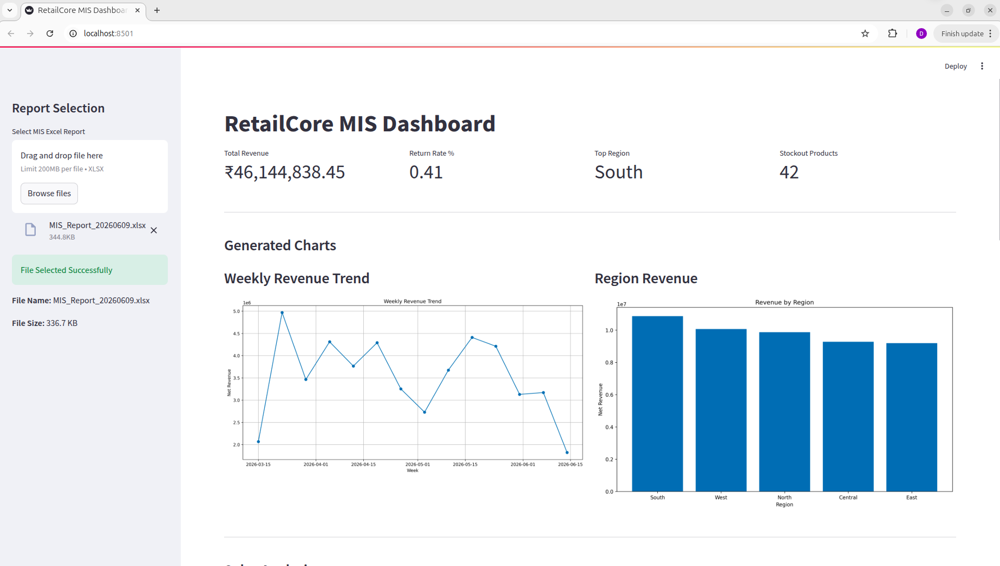
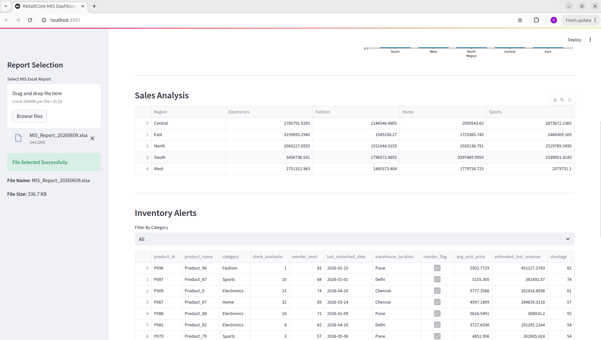
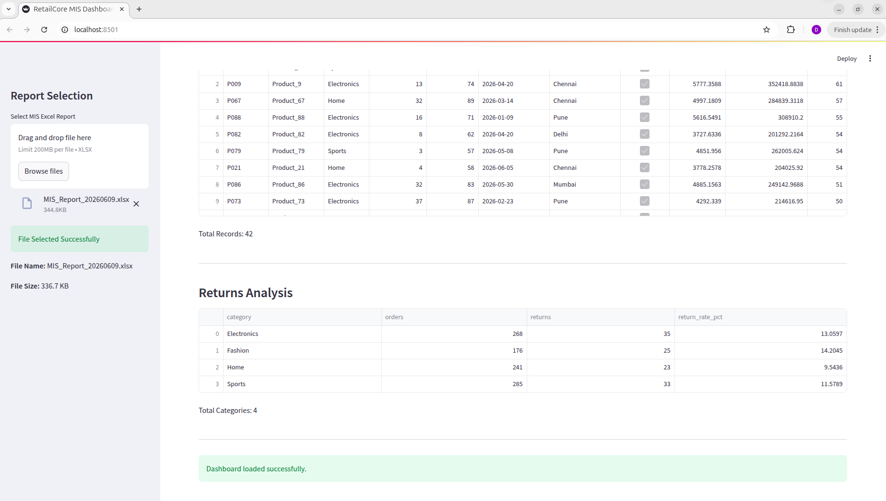
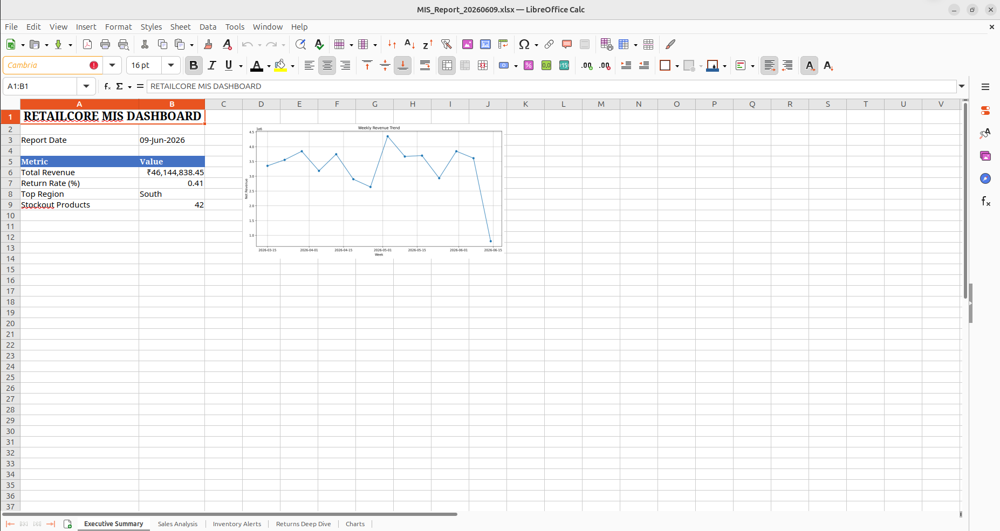
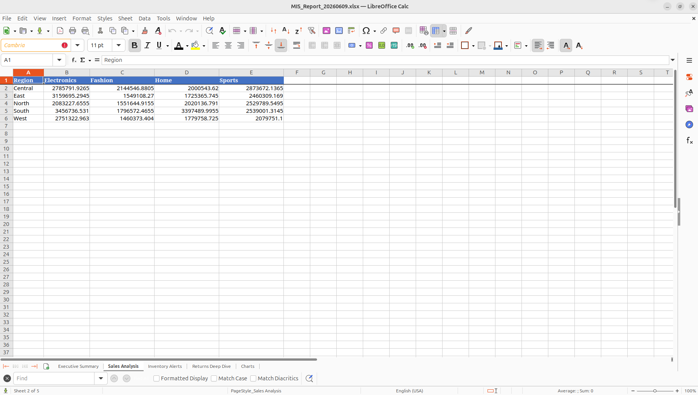
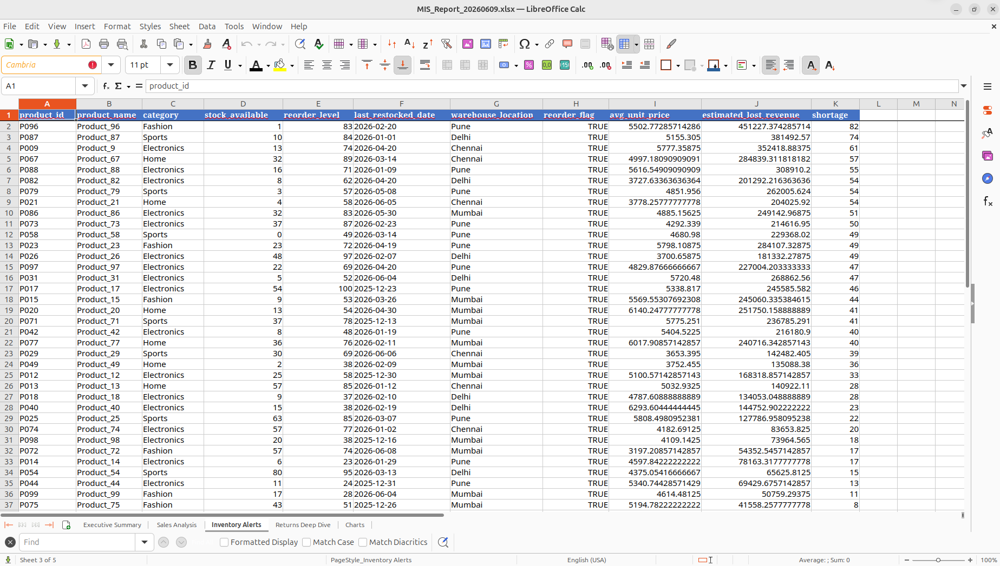
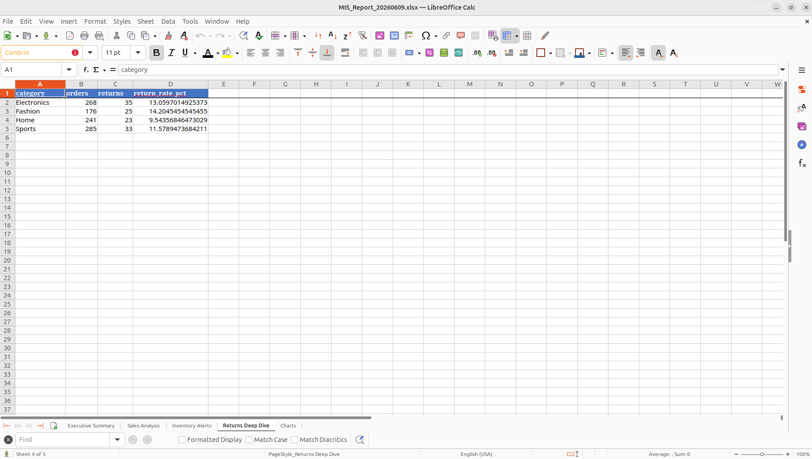
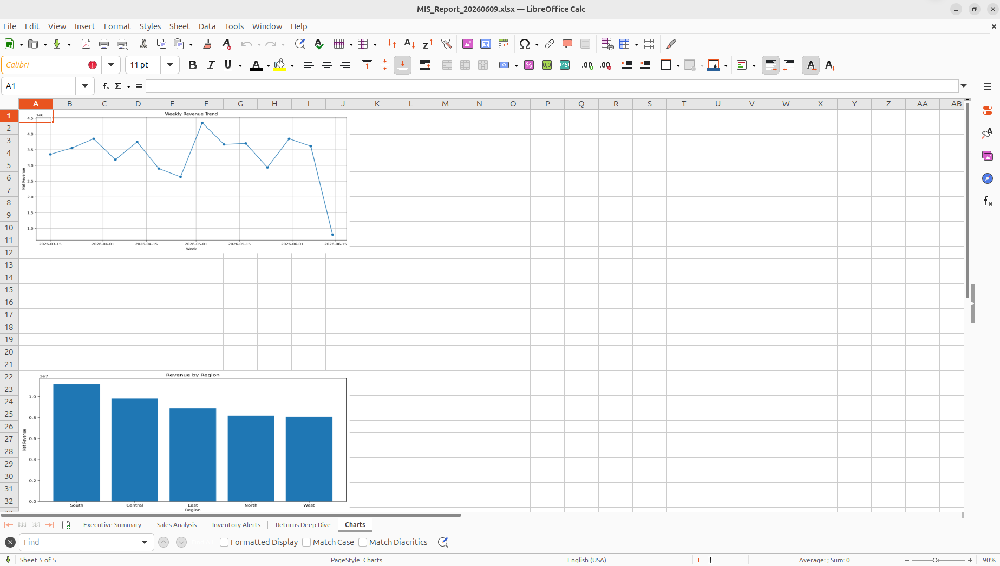
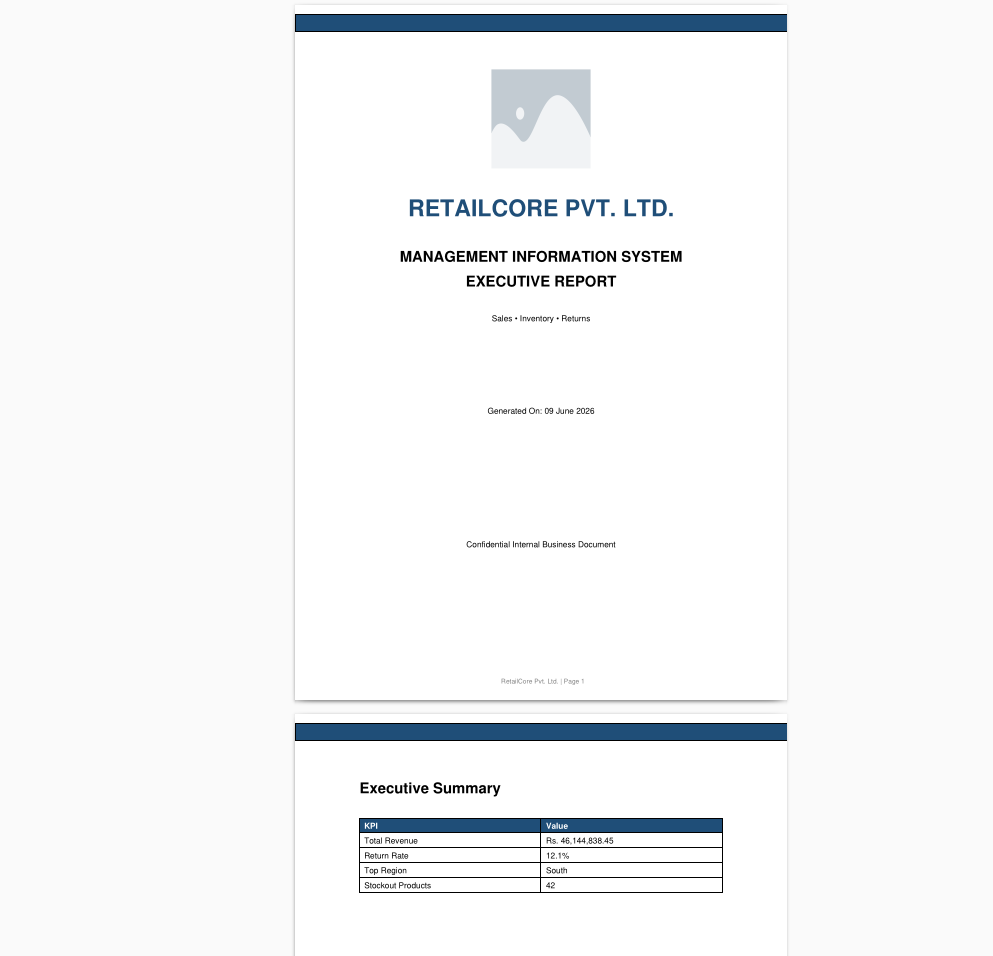
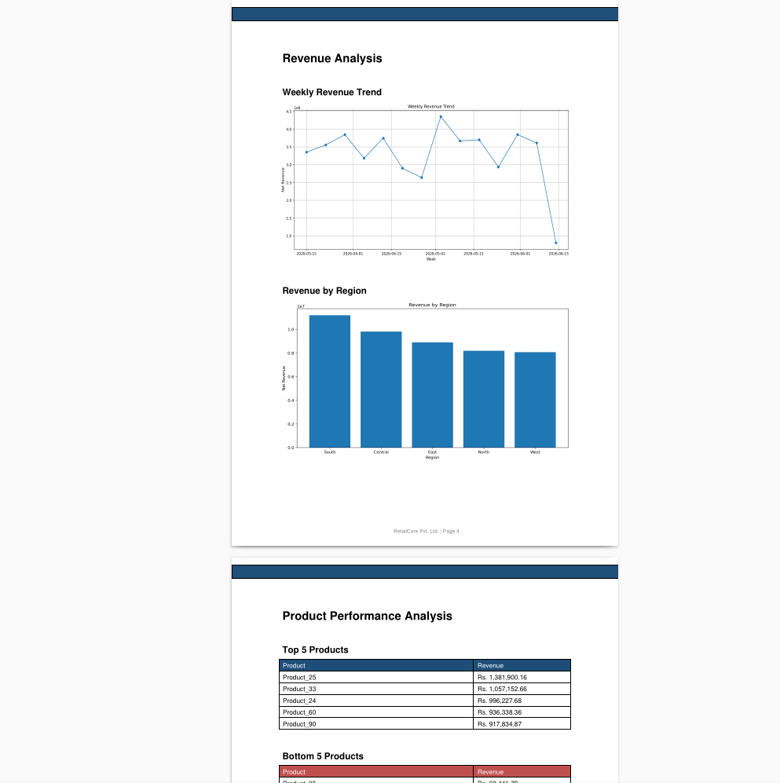

# RetailCore MIS Automation System

## Overview

RetailCore MIS Automation System is a fully automated Python-based reporting solution developed as part of the RetailCore MIS Executive & Automation Expert Technical Assignment.

The system generates mock retail datasets, performs automated data ingestion and cleaning, computes business KPIs, creates visualizations, and generates professional Excel and PDF MIS reports. A Streamlit dashboard is also included for interactive data exploration.

The entire pipeline can be executed using a single command and supports scheduled execution.

---

## Key Features

### Dataset Generation

* Generates realistic retail sales data
* Generates inventory data
* Generates returns data
* Introduces controlled dirty data for cleaning validation

### Automated Data Cleaning

* Removes duplicate order IDs
* Handles missing discount values
* Removes invalid negative quantity records
* Validates dataset schemas
* Creates inventory reorder flags
* Logs all cleaning activities

### Business Analytics

* Revenue by Region
* Revenue by Category
* Revenue by Sales Representative
* Top 5 Products by Revenue
* Bottom 5 Products by Revenue
* Return Rate Analysis
* Inventory Risk Analysis
* Weekly Revenue Trends
* Top Return Reasons
* Stockout Risk Estimation

### Visualizations

* Weekly Revenue Trend Chart
* Revenue by Region Chart
* Dashboard KPI Cards
* Interactive Charts in Streamlit Dashboard

### Reporting

#### Excel MIS Report

* Executive Summary Sheet
* Sales Analysis Sheet
* Inventory Alerts Sheet
* Returns Deep Dive Sheet
* Conditional Formatting
* Auto-sized Columns
* KPI Highlights

#### PDF MIS Report

* Cover Page
* Executive Summary
* KPI Highlights
* Embedded Charts
* Inventory Alert Section
* Business Insights

### Scheduling

* Daily automated execution using `--schedule`
* Configurable execution time

### Dashboard

* Interactive Streamlit Dashboard
* KPI Monitoring
* Revenue Analysis
* Inventory Alert View
* Report Exploration

### Logging

* Timestamped pipeline logs
* Error tracking
* Cleaning activity logs
* Execution status logs

---

## Project Structure

```text
retailcore_assignment/
│
├── assets/
│   └── images/
│       └── company_logo.png
│
├── core/
│   ├── analytics.py
│   ├── charts.py
│   ├── data_generator.py
│   ├── ingestion.py
│   ├── pdf_report.py
│   ├── pipeline.py
│   ├── report_generator.py
│   ├── scheduler.py
│   ├── test_charts.py
│   └── utilities.py
│
├── dashboard.py
├── main.py
├── ASSUMPTIONS.md
├── requirements.txt
├── README.md
│
├── input/
├── output/
├── charts/
└── logs/
```

---

## Installation

### Create Virtual Environment

```bash
python -m venv venv
source venv/bin/activate
```

### Install Dependencies

```bash
pip install -r requirements.txt
```

---

## Command Line Usage

### Run Complete Pipeline

```bash
python main.py
```

### Custom Input Directory

```bash
python main.py --input-dir custom_input
```

### Custom Output Directory

```bash
python main.py --output-dir custom_output
```

### Custom Input and Output Directories

```bash
python main.py --input-dir custom_input --output-dir custom_output
```

### Generate Data Only

```bash
python main.py --generate-data-only
```

### Run Analytics Only

```bash
python main.py --analytics-only
```

### Schedule Daily Execution

```bash
python main.py --schedule
```

### Schedule with Custom Time

```bash
python main.py --schedule --schedule-time 08:00
```

---

## Streamlit Dashboard

Launch the interactive dashboard:

```bash
streamlit run dashboard.py
```

Dashboard Features:

* KPI Summary
* Revenue Analysis
* Product Performance
* Inventory Alerts
* Returns Analysis
* Interactive Filtering

---

## Generated Outputs

### Excel Report

```text
output/MIS_Report_YYYYMMDD.xlsx
```

### PDF Report

```text
output/MIS_Summary_YYYYMMDD.pdf
```

### Charts

```text
charts/weekly_revenue_trend.png
charts/region_revenue.png
```

### Logs

```text
logs/pipeline_YYYY-MM-DD.log
```

---

## Data Cleaning Rules

1. Duplicate Order IDs are removed.
2. Missing discount values are replaced with 0.
3. Negative quantity records are removed.
4. Date fields are converted to datetime format.
5. Inventory reorder flags are automatically generated.
6. All cleaning actions are logged.

---

## Assumptions

Please refer to ASSUMPTIONS.md for complete project assumptions.

---

## Error Handling

The system includes:

* Input file validation
* Schema validation
* Exception handling
* Logging of all critical failures
* Graceful pipeline termination

---

## Technologies Used

* Python 3.12+
* Pandas
* NumPy
* OpenPyXL
* ReportLab
* Matplotlib
* Streamlit
* Schedule

---

## Sample Outputs

The repository includes pre-generated:

* Excel MIS Report
* PDF MIS Report
* Pipeline Log File
* Dashboard Screenshots

---

## Screenshots

### Dashboard





### Excel MIS Report







### PDF MIS Report




---

## Author

Sagar Bhalerao

Technical Assignment Submission – RetailCore MIS Executive & Automation Expert
